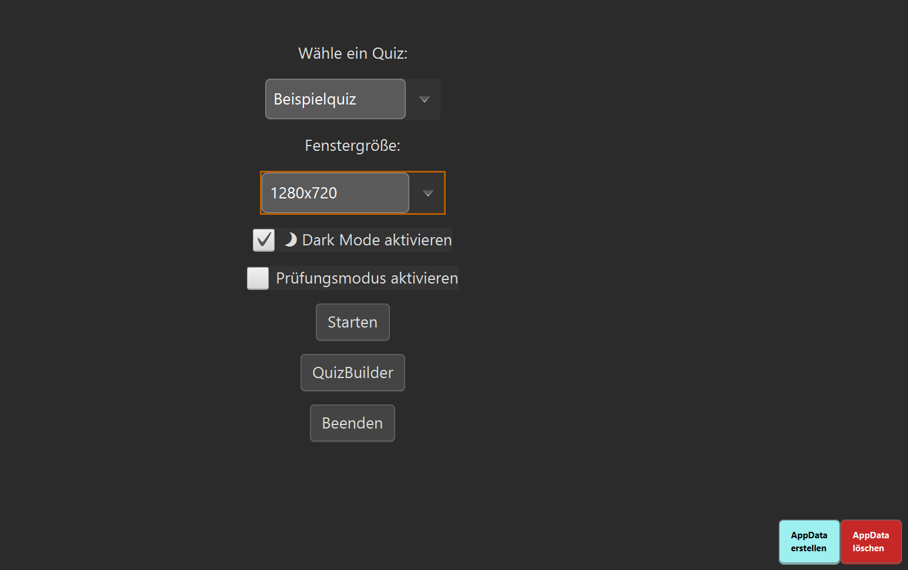
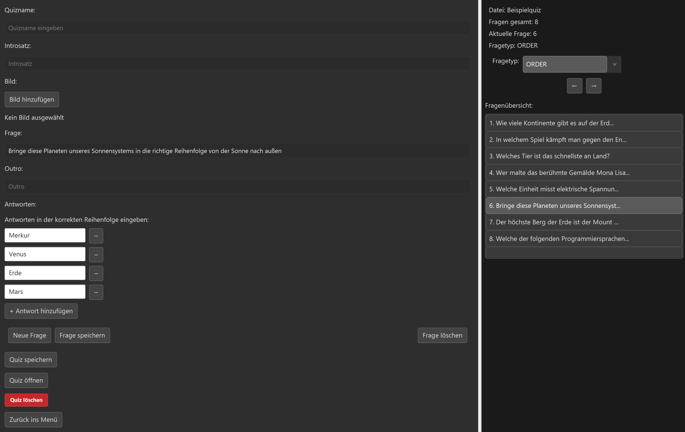
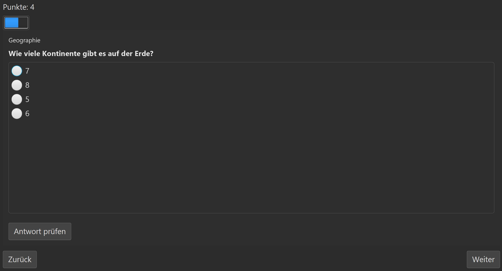
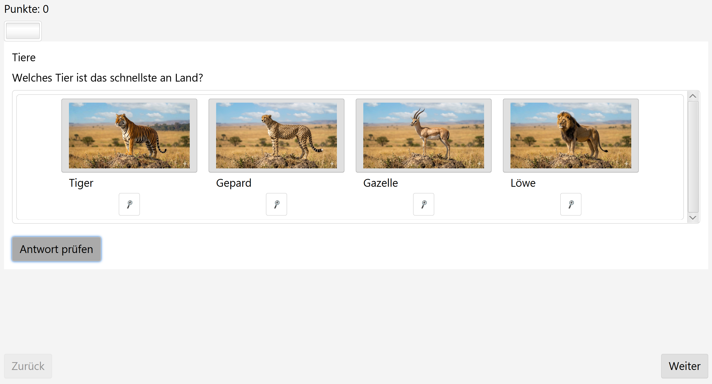

# QuizApp - A JavaFX learning Project that grew into a full Application 
This project started as a small experiment to learn JavaFX.
I wanted to understand layouts, scenes, controllers, and how to structure a desktop application.
What began as a simple test quickly turned into something I genuinely enjoyed building — so I kept expanding it, redesigning it, and eventually turned it into a complete quiz platform with a fully‑featured QuizBuilder.

Today, QuizApp is both a learning journey and a functional tool:
a JavaFX application that lets you create, edit, manage, and play quizzes with multiple question types, custom images, themes, and persistent storage.

---






---

## Features
### QuizApp
- Supports six question types:
  - Single Choice
  - Multiple Choice
  - Image Choice
  - Order Questions
  - Drag & Drop Assignment
  - Fill-in-the-Blank
- Optional Exam Mode (WIP)
- Dark Mode toggle
- Adjustable window sizes and fullscreen support
- Automatic image loading
- Zoomable Images
- JSON-based quiz format
- Scrollable, adaptive UI for all screen sizes

### QuizBuilder (Editor)
The QuizBuilder is a fully interactive editor that lets you create and manage quizzes with ease.

#### Core capabilities
- Create unlimited quizzes
- Add, edit, reorder, and delete questions
- Choose from all supported question types
- Add images to questions andn image-choice options
- Automatic copying of images into AppData
- JSON export with pretty-printed structure
- Load existing quizzes for editing
- Delete entire quizzes including associated images
- Clean AppData reset (no leftover files)

#### Productivity features
- Keyboard shortcuts for almost everything:
  - Save quiz: Ctrl + S
  - Save question: Ctrl + F
  - New question: Ctrl + N
  - Open Quiz: Ctrl + O
  - New Answer: Ctrl + Q
  - And many more
- Question list with instant navigation
- Info panel showing:
  - Current file
  - Total questions
  - Current question index
  - Question type
- Supported question types right now
  - Single Choice (with radio buttons)
  - Multiple Choice (with checkboxes)
  - Image Choice (images to choose from)
  - Order Questions
  - Drag & Drop Assignment (two lists with draggable items)
  - Fill-in-the-Blank

## Architecture Overview
The project follows a clear and maintainable structure:

### JavaFX + MVC-inspired design
- Model
  - QuizData defines the structure of each question
  - Supports options, images, order lists and more
- View
  - Separate view classes for each question type
  - Shared layout via QuizDesign
  - CSS-based theming (light/dark)
- Controller
  - QuizController handles quiz flow, scoring, and navigation
  - QuizBuilder manages the entire editing UI and JSON persistence
  - AppFiles handles AppData paths, image copying, and cleanup

### Data storage
- All quizzes and images are stored in: %AppData%/QuizApp/
- JSON format for quizzes
- Automatic directory creation and cleanup

### UI design
- Dynamic font scaling based on window height
- Scrollable layouts for long questions
- Image zoom
- Consistent spacing and alignment across all question types

## Known Issues & Work in Progress
This Project is still evolving.
There are a few bugs here and there, especially around:
- Switching question types in the builder
- Drag & Drop edge cases
- Image path handling in unusual setups
- Some UI layouts in very small window sizes
I continue improving the project whenever I have time.

## Roadmap
Planned improvements:
- More question types
- UI refinements
- Better validation in QuizBuilder
- Improved error handling
- Load quizzed directly from a Git repository

## Personal Note
This project means a lot to me.
I started it to learn JavaFX — and ended up building a complete application with a custom editor, multiple question types, dynamic UI, JSON persistence, and a modular architecture.

Along the way, I used AI tools to help me understand concepts, debug issues, and explore new ideas.
But every feature, every design decision, and every line of logic reflects my own learning process and growth as a developer.

I’m still improving the app, and I’m proud of how far it has come.

## Running the Project
### Requirements
- Java 17+
- Maven

### Build & Run
```
mvn clean install 
java -jar target/QuizApp.jar\
```

Or download a release from the Releases section.


